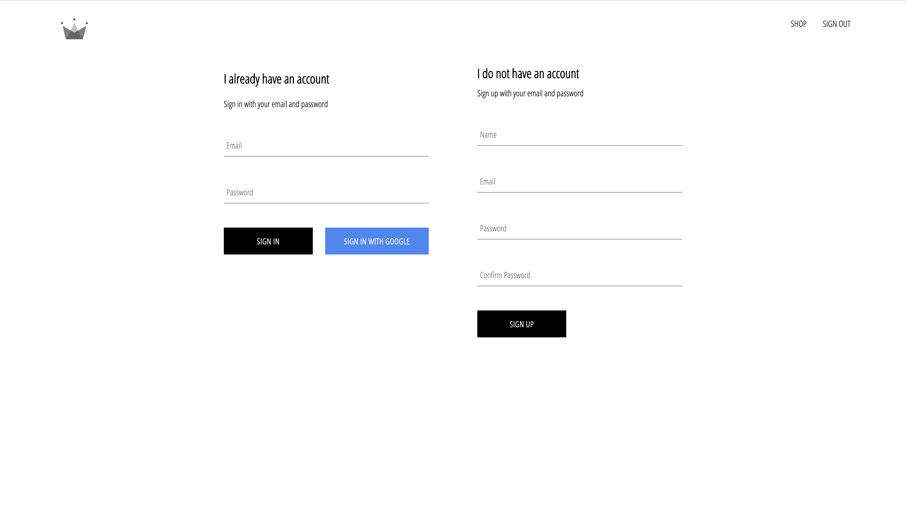

# E-Commerce React Application

Home Page


Shop Page


Sign In Page



## Basic Dependencies

```bash
yarn add sass
yarn add react-router-dom
yarn add firebase
yarn add redux redux-logger react-redux
```

## Lessons

Branch: "Lesson-1-SCSS"

*TBA

Branch: "Lesson-2-Props-and-styles"

*TBA

Branch: "Lesson-3-React-Routing"

*TBA

Branch: "Lesson-4-Header"

* Header or nav bar component
* `Link` from react-router-dom used in `Header` Component
* `Route`, `Switch` from react-router-dom used in `App` Component
* `BrowserRouter` from react-router-dom used in `Index.js` - contains App 


Branch: "Lesson-5-Firebase-Auth"

* Sign in and up page
* Sign In Component
* Form Input Component
* Custom Button Component
* Firebase Auth for Signing In and Out : Pop up window and `auth.onAuthStateChanged()`
* `ComponentWillUnmount()` and `componentDidMount()` Methods in App.js
* Preventing update in submit forms : `event.preventDefault();`

Branch: "Lesson-6-Firestore"

* Sign Up Component 
* Signing Up with email and password- `auth` async method - `createUserWithEmailAndPassword()`
* Query Reference (Document and Collection) in Firestore
* documentSnapshot object from documentRef object methods (`exists`,`data()`)
* documentRef object CRUD methods in Firestore (`set()`,`get()`)
* `async` funtion, and `await`
* Signing In using email and password : `auth` async method - `signInWithEmailAndPassword()`

Branch: "Lesson-7-Redux-intro"

* install redux: `yarn add redux redux-logger react-redux`
* Flux pattern : actions -> reducers -> store -> components
* actions -> middleware -> reducers -> root-reducers -> store -> components
* i.e `user.actions.js`- contains a function returning an object with type and payload properties
* i.e `user.reducer.js`- contains a constant variable and function with switch statement
* i.e `root-reducer.js`- combines all reducers. (`combineReducer` from 'redux')
* i.e `store.js`- creates a store. (`createStore`, `applyMiddleware` from 'redux')
* In `index.js`, all app component must be within `Provider`. (`Provider` from 'react-redux')
* Also in `index.js`, store is a property of `Provider`. (`store` from './redux/store')
* Connecting actions to component - `connect` from 'react-redux'
* if a state should stay in a component, use - `mapDispatchToProps`
* if a state is passed as props in a component, use - ` mapStatetoProps`

Branch: "Lesson-8-Redux-boolean-values"

* Cart Icon Component
* Cart Dropdown Component
* Added cart `reducer`, `actions`, and `types` in `./src/redux/cart`
* `hidden` state can be toggled on and off, withoud payload in actions
* `togglCartHidden` action was dispatch in cart icon
* `hidden` state were `mapStatetoProps` in `header` component
* hidden state (boolean) dictates if `Cart Dropdown` component should be hidden or not 

Branch: "Lesson-9-adding-cart-items"

* Add new `Custom Button` ClassName for Add to Cart
* Add new `cart.utils.js` containing a function for summarizing `cartItems` if multiple same item were added
* Uses  array function `find()` to get mulitple items with same id (same item)

Branch: "Lesson-10-Redux-props-to-component"

* Cart Item component
* cartItems were `mapStateToProps` to Card Dropdown
* Destructuring of objects for ex ... (next line)
* a state containing users and cart reducers are importe like (next line)
* state  ----> { cart : { cartItems }}


## Getting Started with Create React App

This project was bootstrapped with [Create React App](https://github.com/facebook/create-react-app).

## Available Scripts

In the project directory, you can run:

### `yarn start`

Runs the app in the development mode.\
Open [http://localhost:3000](http://localhost:3000) to view it in the browser.

The page will reload if you make edits.\
You will also see any lint errors in the console.

### `yarn test`

Launches the test runner in the interactive watch mode.\
See the section about [running tests](https://facebook.github.io/create-react-app/docs/running-tests) for more information.

### `yarn build`

Builds the app for production to the `build` folder.\
It correctly bundles React in production mode and optimizes the build for the best performance.

The build is minified and the filenames include the hashes.\
Your app is ready to be deployed!

See the section about [deployment](https://facebook.github.io/create-react-app/docs/deployment) for more information.

### `yarn eject`

**Note: this is a one-way operation. Once you `eject`, you can’t go back!**

If you aren’t satisfied with the build tool and configuration choices, you can `eject` at any time. This command will remove the single build dependency from your project.

Instead, it will copy all the configuration files and the transitive dependencies (webpack, Babel, ESLint, etc) right into your project so you have full control over them. All of the commands except `eject` will still work, but they will point to the copied scripts so you can tweak them. At this point you’re on your own.

You don’t have to ever use `eject`. The curated feature set is suitable for small and middle deployments, and you shouldn’t feel obligated to use this feature. However we understand that this tool wouldn’t be useful if you couldn’t customize it when you are ready for it.

## Learn More

You can learn more in the [Create React App documentation](https://facebook.github.io/create-react-app/docs/getting-started).

To learn React, check out the [React documentation](https://reactjs.org/).

### Code Splitting

This section has moved here: [https://facebook.github.io/create-react-app/docs/code-splitting](https://facebook.github.io/create-react-app/docs/code-splitting)

### Analyzing the Bundle Size

This section has moved here: [https://facebook.github.io/create-react-app/docs/analyzing-the-bundle-size](https://facebook.github.io/create-react-app/docs/analyzing-the-bundle-size)

### Making a Progressive Web App

This section has moved here: [https://facebook.github.io/create-react-app/docs/making-a-progressive-web-app](https://facebook.github.io/create-react-app/docs/making-a-progressive-web-app)

### Advanced Configuration

This section has moved here: [https://facebook.github.io/create-react-app/docs/advanced-configuration](https://facebook.github.io/create-react-app/docs/advanced-configuration)

### Deployment

This section has moved here: [https://facebook.github.io/create-react-app/docs/deployment](https://facebook.github.io/create-react-app/docs/deployment)

### `yarn build` fails to minify

This section has moved here: [https://facebook.github.io/create-react-app/docs/troubleshooting#npm-run-build-fails-to-minify](https://facebook.github.io/create-react-app/docs/troubleshooting#npm-run-build-fails-to-minify)
